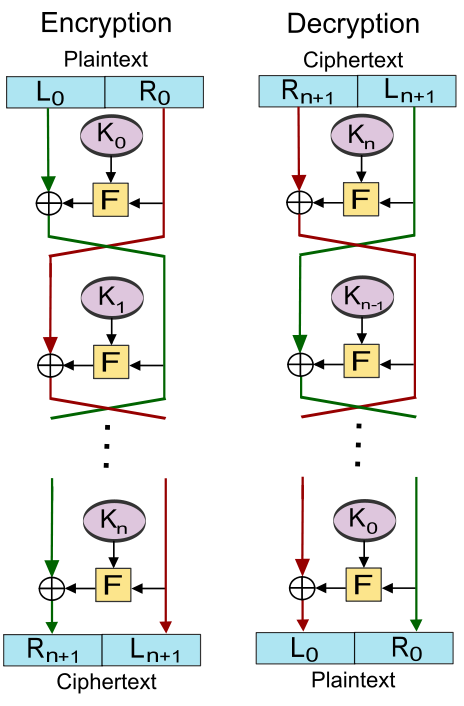

# Feistel Structure

## Overview

1. Consists of a number of identical rounds of processing
2. In each round, a substitution is performed on 1/2 of plaintext block, followed by a permutation that interchanges two halves
3. The original key is expanded so a different key is used in each round
4. The Data Encryption Standard \(DES\) exhibits this structure

## How to

* $$L_i=R_{i−1}$$
* $$R_i=L_{i−1}⊕f(R_{i−1},K_i)$$

## Feistel structure parameters

* Block size & key size:
  * larger means greater security, but may slow down encryption/decryption speed
* Number of rounds:
  * more rounds means greater strength
  * typically 16 rounds
* Subkey generation algorithm & round function:
  * greater complexity should lead to greater cryptanalysis resistance

