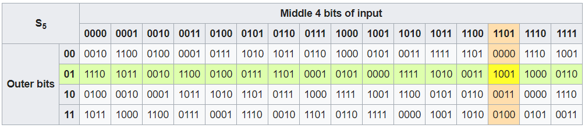

# DES

## Overview

* Use the Feistel structure
  * Block length $$n=64$$, key size $$k=56$$.
  * Number of rounds is $$16$$.

## S-box \(substitution-box\)

* Outer bits: two bits \(the first and last bits\)
* Inner bits: the other four bits between the first and last bits
* e.g.: $$011011$$, outer bits are $$01$$, inner bits are $$1101$$.

## Cryptanalysis

### Brute force

* Try all $$2^{56}$$ possible keys
* Requires no memory, Time-consuming

## Double/Triple encryption \(DES\)

