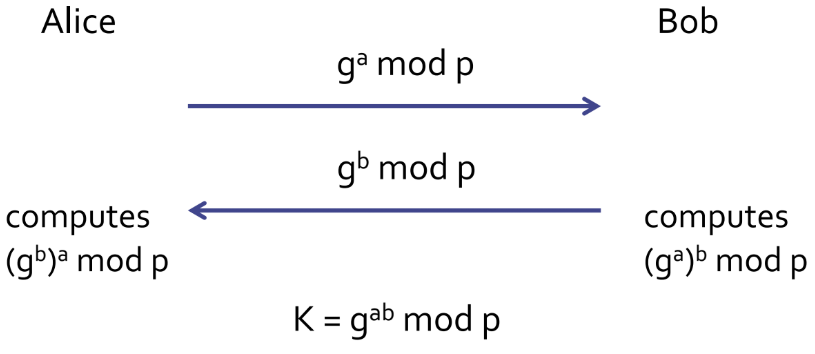

# Diffie-Hellman

## Algorithm

* $$p$$, a large prime integer, public
* $$g$$, a primitive root mod p, public \(also called a generator\)
* Session key is then obtained by both parties calculating:
  * a,ba,b are private to Alice and Bob respectively
  * Kab=gab\(modp\)Kab=gab\(modp\)
  * Alice can compute Kab=gba\(modp\)Kab=gba\(modp\)
  * Bob can compute Kab=gab\(modp\)Kab=gab\(modp\)
* {Message,Password}k

