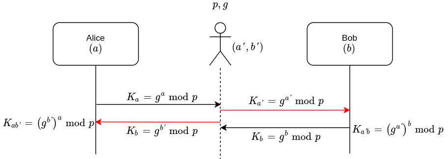

# Diffie-Hellman

## 3-pass

### Algorithm

* $$p$$: a large prime integer, _**public**_
* $$a_1,a_2$$: Alice's private keys
  * $$a_2\equiv {a_1}^{-1}\pmod {p-1}$$
* $$b_1,b_2$$: Bob's private keys
  * $$b_2\equiv {b_1}^{-1}\pmod {p-1}$$
* $$m$$: message to be passed from Alice to Bob

* Pass 1: Alice to Bob
  * $$m^{a_1}\pmod p$$
* Pass 2: Bob to Alice
  * $$(m^{a_1}\pmod p)^{b_1}\pmod p\equiv m^{a_1b_1}\pmod p$$
* Pass 3: Alice to Bob
  * $$(m^{a_1b_1}\pmod p)^{a_2}\pmod p\equiv m^{a_1b_1a_2}\pmod p$$

### Decryption

$$(m^{a_1b_1a_2}\pmod p)^{b_2}\pmod p\equiv m^{a_1b_1a_2b_2}\pmod p\equiv m$$

### Cryptanalysis

## 2-pass \(Key Exchange\)

### Algorithm

* $$p$$, a large prime integer, _**public**_
* $$g$$, a primitive root mod $$p$$\(also called a generator\), _**public**_
* Key $$K_{ab}$$is then obtained by both parties calculating:
  * $$a,b$$ are private to Alice and Bob respectively
  * $$K_{ab}=g^{ab}\pmod p$$
  * Alice can compute $$K_{ab}=g^{ba}\pmod p$$
  * Bob can compute $$K_{ab}=g^{ab}\pmod p$$

### Cryptanalysis

Man in the middle

