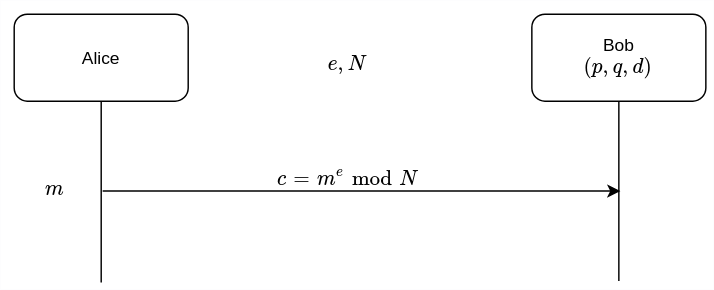

# RSA

Invented in 1978 by Ron **R**ivest, Adi **S**hamir and Leonard **A**dleman.

Based on intractability of the integer factor factorization problem.

## Algorithm

* $$p,q$$: a large prime integer, _**private**_
* $$N$$: compute$$N=pq$$, _**public**_
* _\*\*\*\*_$$\Phi(N)$$: compute $$\Phi(N)=(p-1)(q-1)$$, _**private**_
* $$e$$: choose a random integer $$e: 1< e < \Phi(N) $$, such that gcd$$(e,\Phi(N))=1$$, _**public**_
* $$d$$: determine the unique integer $$d:1< d <\Phi(N)$$, such that $$ed\equiv1\mod{\Phi(N)}$$, _**private**_


$$p,q$$do not need to be kept after $$N,d$$is computed.

That's why in RSA only $$N,e,d$$are kept.


## Encryption

* How it works
  * Alice encryption
    1. Get Bob's authentic public key $$(e,N)$$
    2. Computer $$c=m^e\mod N$$.
    3. Send $$c$$ to Bob.
  * Bob decryption
    1. Compute $$c^d\mod N=m^{ed}\mod N=m\mod N=m$$.
* Why it works
  1. Since $$ed\equiv1\mod{\Phi(N)}$$, there exists an integer $$k$$ such that $$ed\equiv1+k\cdot \Phi(N)$$
  2. $$c^d=m^{ed}=m^{1+k\cdot \Phi(N)}=m^1\cdot m^{k\cdot \Phi(N)}=m^1\cdot (m^{\Phi(N)})^k=m^1\cdot (1)^k=m$$


Compared with Diffie-Hellman, RSA has only one pass and less computation.


## Examples

### Q1

$$p = 11, q = 7\Rightarrow n = 77, \Phi(n) = 60$$

Choose $$e=37\Rightarrow d=13$$\($$ed\mod 60\equiv481\mod60\equiv 1$$\)

Let $$m=15\Rightarrow C\equiv 15^{37}\mod 77=71$$

Then $$c^d=71^{13}\mod 77=15$$

## Speed up encryption

Square and multiply exponentiation

The smaller the number of 1 bits, the better. Example: $$e= 2^{16} + 1 = 65537$$

## Speed up decryption

See practice 2 problem 3



## Parameter selections

* RSA usually described as the number of bits for $$n$$. Current recommendation is at least $$1024$$ bits for $$n$$.
* $$p$$ and $$q$$ must have the same bit length, so for $$1024$$ bits RSA, p and q must be about $$512$$ bits.
  * $$2^{512}\times 2^{512}=2^{1024}$$
  * Randomly generate a large odd number and then test whether it is prime.

## Cryptanalysis

### Key recovery attacks 

### Brute force key search

> 1024 bits means
>
> > 179769313486231590772930519078902473361797697894230657273430081157732675805500963132708477322407536021120113879871393357658789768814416622492847430639474124377767893424865485276302219601246094119453082952085005768838150682342462881473913110540827237163350510684586298239947245938479716304835356329624224137216
>
> possible numbers. Even with the best computers, it would take far longer than the universe exists.





### Timing attacks 

By measuring the time required to perform decryption \(exponentiation with the private key as exponent\), an attacker can figure out the private key.

#### Possible countermeasures

* use constant exponentiation time
* add random delays

### Mathematical attacks

Three possible approaches, all of them are equivalent to factoring $$n$$:

* Factor $$n = pq$$
* Determine $$\Phi(n)$$
* Find the private key $$d$$ directly

## Examples

### Low exponent

### Common module

$$c_1 = m^{e_1} \mod n, c_2 = m^{e_2} \mod n$$

$$(e_1)a + (e_2) b = 1$$ if $$gcd(e_1,e_2)=1$$

$$m = c_1^a c_2^b \mod n$$

### Twin prime

$$(p, p\pm2)$$

### Common $$p$$

$$N_1=pq_1, N_2=pq_2\Rightarrow gcd(N_1,N_2)=p$$

###  $$x^2,y^2$$

$$x\neq y\mod N$$, but $$x^2=y^2\mod N$$, then $$\Rightarrow gcd(N,x\pm y)=p$$

e.g.: 

### Factoring when knowing $$e$$ and $$d$$

### Multiplicative property

